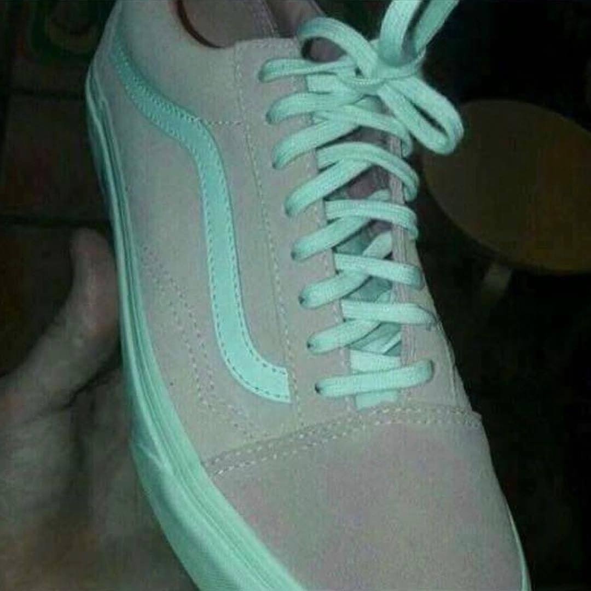
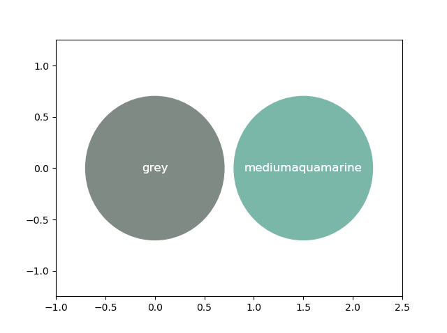

# What color is the shoe?

## Solving the age old riddle using python and data science

  

Some people look at the shoe and say that it is pink and white, others say its gray and blueish green. I took the liberty of anlyzing the two colors in this photo using scipy and numpy libraries. The results may, or may not surprise you.

## Pipeline

The following steps were taken to analyze the photo:

- Using photoshop, the image was split into two parts. Image A has pink/gray parts, image B has blue/white.
- Loading of the two images using `skimage`
- Extracting the pixels that are completely opaque
- Performing either mean or median function on the extracted pixels (median is prefered and default)
- Converting the mean/median color that is in RGB, into a readable english color using `webcolors` lib.
- Plotting the result using `matplotlib`

## Analysis using Median Strategy

Using median, the color is found to be gray and medium aquamarine (basically green).

## Analysis using Mean Strategy

Using mean, the color turned out as gray and cadet blue. There's a little difference between the pixel values of both strategies.

## So why do some people see pink and white?

There are red artifacts in the gray part of the shoe. These artifacts are present because the picture was taken in low light conditions. Compressing the image for web viewing further decreases the quality, enhancing these reddish artifacts. Exactly why some people are more perceptive about this phenomenon is still a bit unclear.

## Stay In Touch

For latest releases and announcements, check out my site: [aliashraf.net](http://aliashraf.net)

## License

This software is released under the [MIT License](LICENSE). Please read LICENSE for information on the
software availability and distribution.

Copyright (c) 2019 [Ali Ashraf](http://aliashraf.net)